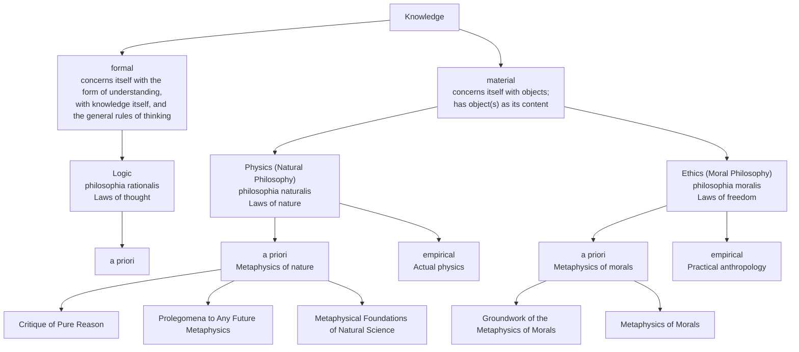
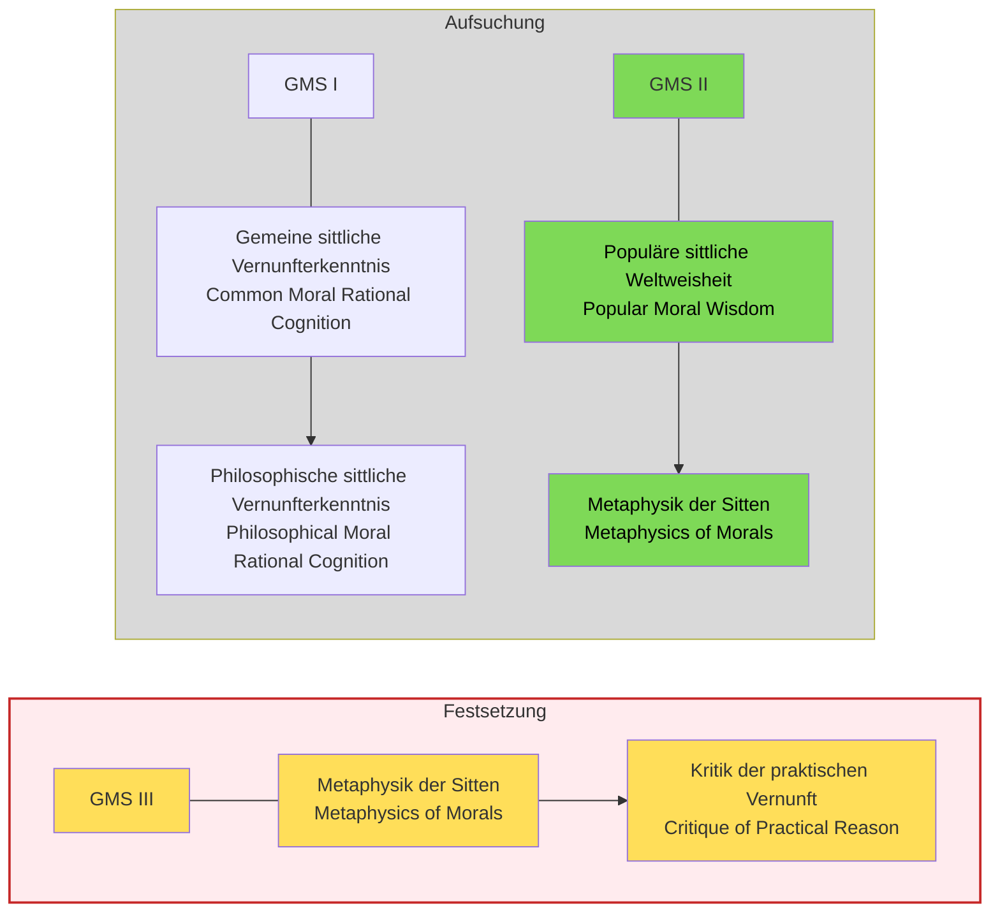


This interpretation is not my own but based on a seminar I heard at the University of KIT where this work was treated. Further, the text passages I will cite are in german, mabye I will translate this but probably not.


### Preface

One of the first things that we get in the preface is a strcuture of the different fields of philsophy like kant envions thems

And as we can see the work which this article is about can be categorized to the Ethical purely a priori branch. This categorication is not new and is alreday done similar with aristotele, what is new is how kant talks about these branches as laws.

The next passages highlight this:

> ob man nicht meine, daß es von der **äußersten Notwendigkeit** sei, einmal eine reine Moralphilosophie zu bearbeiten, die von allem, was nur empirisch sein mag und zur Anthropologie gehört, völlig gesäubert wäre; denn, daß es eine solche geben müsse, leuchtet von selbst aus der gemeinen Idee der Pflicht und der sittlichen Gesetze ein. Jedermann muß eingestehen, daß ein Gesetz, wenn es moralisch, d.i. als Grund einer Verbindlichkeit, gelten soll, **absolute Notwendigkeit** bei sich führen müsse;

When Kant talks about morlaity he mean laws, that are nessecarily and a priori true and not jsut practical rules that one does because they are beneficial, they are not contingent on us humans i.e. they are not ruels unqiue to us human but apply to all being with rationality.

> daß mithin der **Grund der Verbindlichkeit** hier nicht in der Natur des Menschen oder den Umständen in der Welt, darin er gesetzt ist, gesucht werden müsse, sondern **a priori** lediglich in Begriffen der reinen Vernunft,

Anf furtehr every other rule is can maybe called a pratical rule but never a moral law. Morlaity needs nessecaity, withotu nessecarity we do not have a moral law.

> **daß jede andere Vorschrift**, die sich auf Prinzipien der bloßen Erfahrung gründet, und sogar eine in gewissem Betracht allgemeine Vorschrift, so fern sie sich dem mindesten Teile, vielleicht nur einem Bewegungsgrunde nach, auf empirische Gründe stützt, **zwar eine praktische Regel, niemals aber ein moralisches Gesetz heißen kann**.

Hence the argument in the preface goes in very short as follows:
1. Morality is connected with lawfulness.
2. Laws hold (in contrast to regularities) with necessity.
3. Necessity can only be recognized a priori.
4. The discipline that proceeds purely a priori is called metaphysics.
5. Therefore, a “metaphysics of morals” is necessarily required.

> **Eine Metaphysik der Sitten ist also unentbehrlich notwendig**, nicht bloß aus einem Bewegungsgrunde der Spekulation, um die Quelle der a priori in unserer Vernunft liegenden praktischen Grundsätze zu erforschen, sondern **weil die Sitten selber allerlei Verderbnis unterworfen bleiben, so lange jener Leitfaden und oberste Norm ihrer richtigen Beurteilung fehlt.** Denn bei dem, was moralisch gut sein soll, ist es nicht genug, daß es dem sittlichen Gesetze gemäß sei, sondern es muß auch um desselben willen geschehen; widrigenfalls ist jene Gemäßheit nur sehr zufällig und mißlich, weil der unsittliche Grund zwar dann und wann gesetzmäßige, mehrmalen aber gesetzwidrige Handlungen hervorbringen wird. **Nun ist aber das sittliche Gesetz in seiner Reinigkeit und Echtheit (woran eben im Praktischen am meisten gelegen ist) nirgend anders als in einer reinen Philosophie zu suchen, also muß diese (Metaphysik) vorangehen, und ohne sie kann es überall keine Moralphilosophie geben;**

### Structure of the Work

The Grundlegung zur Metaphysik der Sitten" is structured in multiple sections:
1. Preface
2. Common moral rational knowledge -> Philosophical moral knowledge
3. Popular moral philosophy -> Metaphysics of Morals
4. Metaphysics of Morals → Critique of Practical Reason

It is important to know the purpose of the each section. The preface gives an overview of the field of philsophy and place thsi work inside it, further it desicbes the strcuture of kants work and what his goal is.
Next The second and thrid section are both seciton with the goal of ivnestiation the highest law of morality, by starting at soemwhere and then deriving this law, but both ection start with a differnet entry poind, the seocnd section starts with the common moral udnerstanding of the common man and tries do deive the highest law, whiel the thrid seciton start mroe philsophical with more rigor for ma philsophcia lview point. both sction can be seen at different attemt usign different routes to derives the hgihest law, the secodn section is more appraochable for the common man, whiel the htrid is mroe philsophcial rigorious.
In the last section, after he has derived the heighest aklw i nthe preivous seciton he now needs to show that this law is not innert btu actual is active and exist this is the goal of this section.

# 1. Section

## First Sentence

The first sentence of the first section is:

> Es ist überall nichts in der Welt, ja überhaupt auch außer derselben zu denken möglich, was ohne **Einschränkung** für **gut** könnte gehalten werden, als allein ein **guter Wille**.
> Immanuel Kant: *Grundlegung zur Metaphysik der Sitten*, 393

Some interpreters of Kant consider this sentence extremely important, seeing it as already containing the core of Kant’s entire project. Others, however, see it as more of a rhetorical or introductory remark. In any case, as the opening sentence, it carries interpretive weight. The key question is therefore what it actually means.

To understand this, we need to clarify what Kant means by *“uneingeschränkt”*, *“guter Wille”*, and *“gut”*. Each of these terms has multiple possible interpretations.

## Possible interpretations of “uneingeschränkt” (without restriction)

### 1. The highest good

One plausible interpretation is that “uneingeschränkt gut” refers to the highest good: the best thing a human being can aim for in life, that which ultimately matters in a complete sense. In this reading, Kant would be engaging with the ancient tradition of the *summum bonum*.

### 2. Completely / purely good

Here “uneingeschränkt” means *fully*, *purely*, or *without any admixture*. Similar to how a service can be “uneingeschränkt empfehlenswert” (unreservedly recommendable). A good will would then be something flawless or pure, good “without any caveats.”

### 3. Highest form of value or esteem

In this interpretation, the emphasis is not on ontological purity but on evaluation: a good will is what deserves the highest praise and recognition.

### 4. Absolutely / unconditionally good

Here “uneingeschränkt” means *always and everywhere*, *under all conditions*, or *intrinsically*. The goodness of the will does not depend on external circumstances. It is good in itself. One variant of this reading even claims that it is the only thing that is good in an absolute sense, not merely relative to something else.

In the *Grundlegung*, textual support can be found for all of these interpretations in different passages (e.g. 394, 396, 403, 428, 437).

## Textual support for “highest value / highest good”

> Dieser Wille darf also zwar nicht das einzige und das ganze, aber er muß doch das höchste Gut, und zu allem übrigen, selbst allem Verlangen nach Glückseligkeit, die Bedingung sein (396)

> Allerdings! gerade da hebt der Wert des Charakters an, der moralisch und ohne alle Vergleichung der höchste ist, nämlich dass er wohltue, nicht aus Neigung, sondern aus Pflicht. (398f.)

> Man könne nun meinen, dass „Achtung fürs praktische Gesetz dasjenige sei, was die Pflicht ausmacht, der jeder andere Beweggrund weichen muss, weil sie die Bedingung eines an sich guten Willens ist, dessen Wert über alles geht. (403)

## Textual support for “highest esteem / highest evaluative rank”

> Um aber den Begriff eines an sich selbst hochzuschätzenden und ohne weitere Absicht guten Willens, […] diesen Begriff, der in der Schätzung des ganzen Werts unserer Handlungen immer obenan steht und die Bedingung alles übrigen ausmacht, zu entwickeln […] (397)

> Der gute Wille ist […] an sich gut, und, für sich selbst betrachtet, ohne Vergleich weit höher zu schätzen, als alles … (394)

> “…die Hochschätzung, die man übrigens mit Recht für sie trägt, einschränkt, und es nicht erlaubt, sie für schlechthin gut zu halten.” (393)

## Textual support for “unconditional / absolute goodness”

> Einige Eigenschaften sind sogar diesem guten Willen selbst beförderlich und können sein Werk sehr erleichtern, haben aber demungeachtet keinen inneren unbedingten Wert […] (394)

> Wir können nunmehr da endigen, von wo wir im Anfange ausgingen, nämlich dem Begriffe eines unbedingt guten Willens. (437)

> Gesetzt aber, es gäbe etwas, dessen Dasein an sich selbst einen absoluten Wert hat […], so würde in ihm, und nur in ihm allein, der Grund eines möglichen kategorischen Imperativs, d. i. praktischen Gesetzes, liegen. (428)

## What could “good will” refer to?

There are several possible referents:

### 1. Actions

The good will refers to intentions, motives, or principles behind actions.

### 2. Character

The good will refers not to isolated actions, but to a person’s overall moral disposition or character.

### 3. A faculty or capacity

Humans, unlike animals, have a rational nature: a free will or autonomy. In this sense, “will” refers to a capacity to act according to reasons. This capacity is what makes morality possible—and simultaneously makes us subject to it.

## Interpretation space

From this, one can derive a large number of interpretive combinations (often up to 24 depending on how one disambiguates each term). Not all are equally plausible, but many have been defended in the literature.

For example:

> Kant nimmt im ersten Satz der Grundlegung die antike Grundfrage der Ethik nach dem höchsten Gut auf und beantwortet sie im Sinne dessen, was ihm die allgemein verbreitete Auffassung zu sein scheint. […] Wie nun die folgenden Sätze zeigen, meint Kant mit einem »guten Willen« weder bloß vereinzelte gute Absichten noch einzelne Charaktereigenschaften, sondern gute moralische Grundsätze überhaupt, d.h. eine gute Gesinnung, einen guten Charakter (der sich natürlich in guten Willensakten äußern wird). Fragt man also einen Menschen mit gesundem moralischen Menschenverstand danach, was er für die überhaupt beste Sache hält, die er sich denken kann, so erhält man die Antwort, dies sei ein Wesen, das rundum moralisch gut ist.
> Jens Timmermann (Hg.): *Grundlegung zur Metaphysik der Sitten*, 91

> Nur der gute Wille und, mit Blick auf den Menschen, die Achtung vor dem moralischen Gesetz haben uneingeschränkten moralischen Wert.
> Dieter Schönecker & Allen Wood: *Kants Grundlegung zur Metaphysik der Sitten*, 40

## Kant’s “jewel passage” (central clarification)

> Der **gute Wille** ist nicht durch das, was er bewirkt, oder ausrichtet, nicht durch seine Tauglichkeit zur Erreichung irgend eines vorgesetzten Zweckes, sondern **allein durch das Wollen, d.i. an sich, gut**, und, für sich selbst betrachtet, ohne Vergleich weit höher zu schätzen, als alles, was durch ihn zu Gunsten irgend einer Neigung, ja, wenn man will, der Summe aller Neigungen, nur immer zu Stande gebracht werden könnte. [...]

This passage is crucial because it shows Kant’s core idea: the good will has value independently of consequences. Even if it achieves nothing, it still has full worth—like a jewel.

Here Kant also implicitly introduces a criterion:

A will is *uneingeschränkt gut* if it cannot be used for evil purposes. Virtue, health, or wealth fail this test because they can be used for bad ends. Only the good will passes it, because it is good in itself.

## Final argument: teleology critique

Finally, Kant offers a teleological argument: if nature had designed humans for happiness, then reason would often be counterproductive. Reason frequently produces moral reflection that conflicts with desire (e.g., questioning whether eating meat is permissible).

Since reason often reduces happiness rather than increasing it, the purpose of nature cannot be simply to make us happy. This supports Kant’s rejection of happiness as the ultimate end of human rational nature.

### 2. Section
