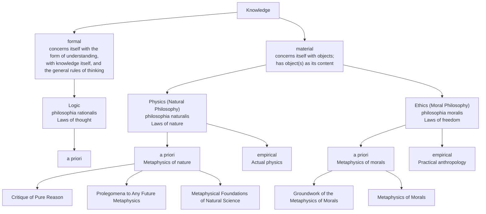
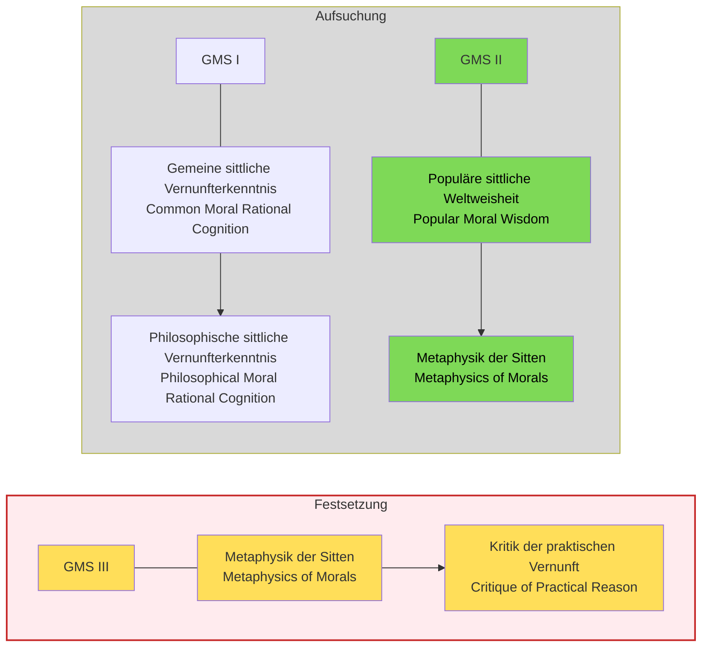


This interpretation is not my own but based on a seminar I heard at the University of KIT where this work was treated. Further, the text passages I will cite are in german, mabye I will translate this but probably not.


### Preface

One of the first things that we get in the preface is a strcuture of the different fields of philsophy like kant envions thems

And as we can see the work which this article is about can be categorized to the Ethical purely a priori branch. This categorication is not new and is alreday done similar with aristotele, what is new is how kant talks about these branches as laws.

The next passages highlight this:

> ob man nicht meine, daß es von der **äußersten Notwendigkeit** sei, einmal eine reine Moralphilosophie zu bearbeiten, die von allem, was nur empirisch sein mag und zur Anthropologie gehört, völlig gesäubert wäre; denn, daß es eine solche geben müsse, leuchtet von selbst aus der gemeinen Idee der Pflicht und der sittlichen Gesetze ein. Jedermann muß eingestehen, daß ein Gesetz, wenn es moralisch, d.i. als Grund einer Verbindlichkeit, gelten soll, **absolute Notwendigkeit** bei sich führen müsse;

When Kant talks about morlaity he mean laws, that are nessecarily and a priori true and not jsut practical rules that one does because they are beneficial, they are not contingent on us humans i.e. they are not ruels unqiue to us human but apply to all being with rationality.

> daß mithin der **Grund der Verbindlichkeit** hier nicht in der Natur des Menschen oder den Umständen in der Welt, darin er gesetzt ist, gesucht werden müsse, sondern **a priori** lediglich in Begriffen der reinen Vernunft,

Anf furtehr every other rule is can maybe called a pratical rule but never a moral law. Morlaity needs nessecaity, withotu nessecarity we do not have a moral law.

> **daß jede andere Vorschrift**, die sich auf Prinzipien der bloßen Erfahrung gründet, und sogar eine in gewissem Betracht allgemeine Vorschrift, so fern sie sich dem mindesten Teile, vielleicht nur einem Bewegungsgrunde nach, auf empirische Gründe stützt, **zwar eine praktische Regel, niemals aber ein moralisches Gesetz heißen kann**.

Hence the argument in the preface goes in very short as follows:
1. Morality is connected with lawfulness.
2. Laws hold (in contrast to regularities) with necessity.
3. Necessity can only be recognized a priori.
4. The discipline that proceeds purely a priori is called metaphysics.
5. Therefore, a “metaphysics of morals” is necessarily required.

> **Eine Metaphysik der Sitten ist also unentbehrlich notwendig**, nicht bloß aus einem Bewegungsgrunde der Spekulation, um die Quelle der a priori in unserer Vernunft liegenden praktischen Grundsätze zu erforschen, sondern **weil die Sitten selber allerlei Verderbnis unterworfen bleiben, so lange jener Leitfaden und oberste Norm ihrer richtigen Beurteilung fehlt.** Denn bei dem, was moralisch gut sein soll, ist es nicht genug, daß es dem sittlichen Gesetze gemäß sei, sondern es muß auch um desselben willen geschehen; widrigenfalls ist jene Gemäßheit nur sehr zufällig und mißlich, weil der unsittliche Grund zwar dann und wann gesetzmäßige, mehrmalen aber gesetzwidrige Handlungen hervorbringen wird. **Nun ist aber das sittliche Gesetz in seiner Reinigkeit und Echtheit (woran eben im Praktischen am meisten gelegen ist) nirgend anders als in einer reinen Philosophie zu suchen, also muß diese (Metaphysik) vorangehen, und ohne sie kann es überall keine Moralphilosophie geben;**

### Structure of the Work

The Grundlegung zur Metaphysik der Sitten" is structured in multiple sections:
1. Preface
2. Common moral rational knowledge -> Philosophical moral knowledge
3. Popular moral philosophy -> Metaphysics of Morals
4. Metaphysics of Morals → Critique of Practical Reason

It is important to know the purpose of the each section. The preface gives an overview of the field of philsophy and place thsi work inside it, further it desicbes the strcuture of kants work and what his goal is.
Next The second and thrid section are both seciton with the goal of ivnestiation the highest law of morality, by starting at soemwhere and then deriving this law, but both ection start with a differnet entry poind, the seocnd section starts with the common moral udnerstanding of the common man and tries do deive the highest law, whiel the thrid seciton start mroe philsophical with more rigor for ma philsophcia lview point. both sction can be seen at different attemt usign different routes to derives the hgihest law, the secodn section is more appraochable for the common man, whiel the htrid is mroe philsophcial rigorious.
In the last section, after he has derived the heighest aklw i nthe preivous seciton he now needs to show that this law is not innert btu actual is active and exist this is the goal of this section.

### 1. Section

### 2. Section
